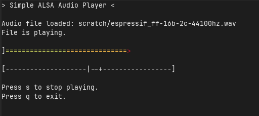

# Audio Digital Signal Processing

This project will contain examples and notes on
digital signal processing for audio.

We're currently using the Q library
([GitHub](https://github.com/seansovine/audio_dsp))
of Joel de Guzman.

## Simple ALSA WAV player

A console app to play a WAV file from the command line using ALSA. The ALSA code is in:

+ [`alsa_player.h`](src/audio_player/lib/alsa_player.h) / [`alsa_player.cpp`](src/audio_player/lib/alsa_player.cpp)

It plays a WAV file at the path passed as its first command line arg, or
plays a test file if no file path is passed. It loads the file's data using
[kfr](https://github.com/kfrlib/kfr), which is a very nice library for DSP in C++.

We've now implemented a basic `ncurses` text user interface for this.
The main architecture for managing the app and user interface is in:

+ [`audio_player_app.h`](src/audio_player/lib/audio_player_app.h)
+ [`audio_player_main.cpp`](src/audio_player/audio_player_main.cpp)

_Console app:_

<p align="center" margin="20px">
	
</p>

_Real-time considerations:_

To allow the user to control the audio output and visualizing
audio information (like intensity or spectrum) *as the audio is playing*, we need
real-time ineraction between the user interface and the playback loop that is
processing samples and feeding them to the sound card. We handling this by
running the playback loop in a separate thread and allowing the
playback and UI threads to communicate using atomic shared variables.

## ALSA playback example

A simple program to play a WAV file directly using the ALSA PCM API:

+ [`simple_alsa_audio.cpp`](src/examples/simple_alsa_audio.cpp)

This is based mostly on Alessandro Ghedini's example here:
[GitHub gist](https://gist.github.com/ghedo/963382/815c98d1ba0eda1b486eb9d80d9a91a81d995283)

The usage is like:

```shell
<BIN_DIR>/SimpleAlsaPlayer < media/<FILENAME>.wav
```

I added some comments in the code to explain the meanings
of various quantities and function calls. I also added a little
C++ class that takes a lambda in its constructor and mimics
the behavior of Go's `defer` keyword, which I think is neat :)

Some more good sources of information on ALSA are:

+ Alex Via [blog post](https://alexvia.com/post/003_alsa_playback/) on ALSA playback
+ ALSA PCM [docs](https://www.alsa-project.org/alsa-doc/alsa-lib/pcm.html)

## Q example

This is in [`first_example_w_q.cpp`](src/examples/first_example_w_q.cpp).

It reads in a WAV file and extracts its sample data
using utilities from Q, then modifies the samples, simply
by reducing the amplitude to 10% of original, then writes
the modified samples out to a new WAV file.

The purpose of this is just to test that we can get access
to the sample data and successfully modify it. Now that
we've gotten this far, we can start working on more interesting
processing and learn more of the features of Q.

## Next Ideas

**Graphic EQ:**

We will implement a basic graphic equalizer using
an IIR filter, and add this to our ALSA audio player application.
We plan to apply this filter in real time,
so parameters can be adjusted and the results heard as the file is playing.

**Hardware interaction libraries:**

We are currently using ALSA, which is pretty low-level. However, there are
some good libraries providing APIs that encapsulate the hardware interaction.
We will look at some of these later.
